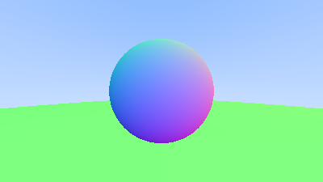
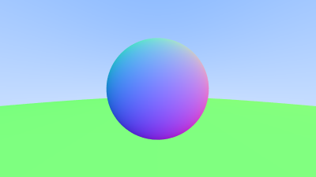
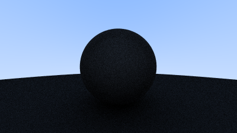
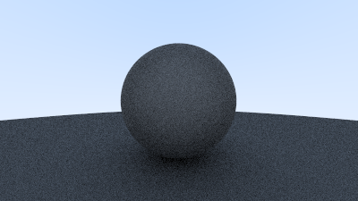
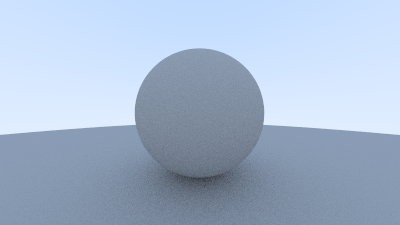
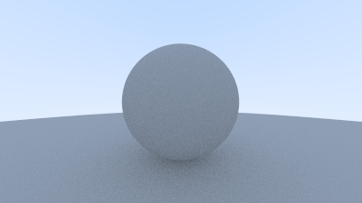
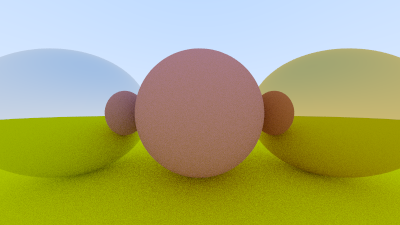
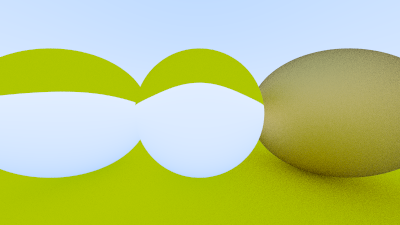
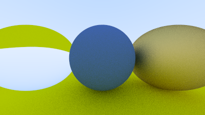
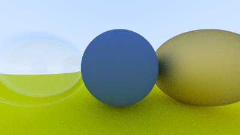

# Rust Language Ray Tracing Tutorial
Tutorial link:
[RayTracing v3.2.3](https://github.com/RayTracing/raytracing.github.io/releases/tag/v3.2.3)

Phase 1 image
 

 
Phase 2 image
 

 
Phase 3 image
 

 
Phase 4 image
 

 
Phase 5 image
 

 
Phase 6 image (same as previous but with antialiasing)
 

 
Phase 7 image
 

 
Phase 8 image
 

 
Phase 9 image
 

 
Phase 10 image
 

 
Phase 11 image
 

 
Phase 12 image
 

 
Phase 13 image
 

 
Phase 14 image
 

 
Phase 15 image
 

