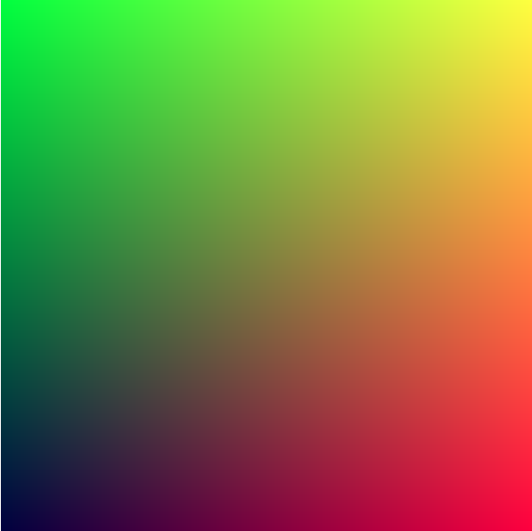
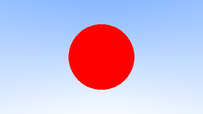

# Rust Language Ray Tracing Tutorial
Tutorial link:
[RayTracing v3.2.3](https://github.com/RayTracing/raytracing.github.io/releases/tag/v3.2.3)

Phase 1 image
 

 
Phase 2 image
 

 
Phase 3 image
 

