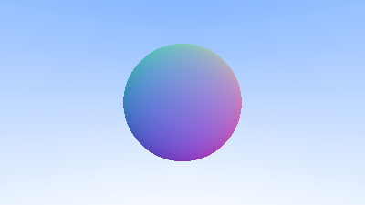
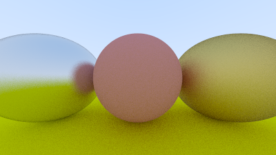
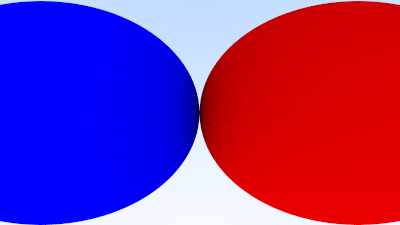
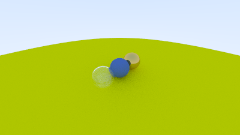
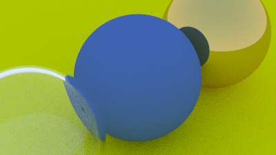
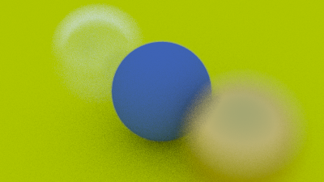
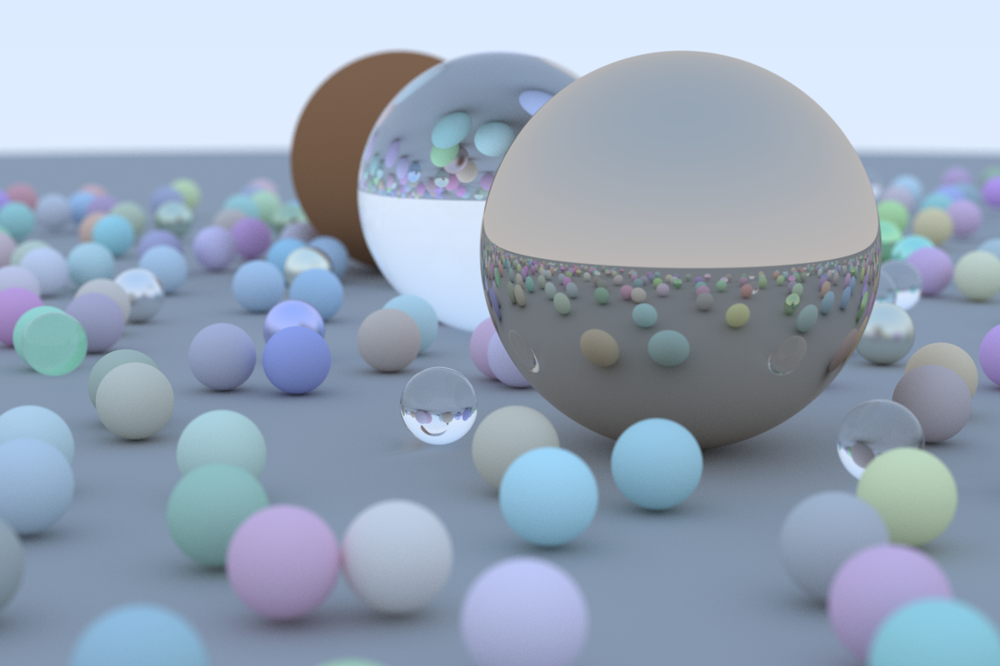
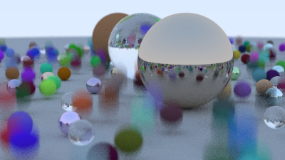
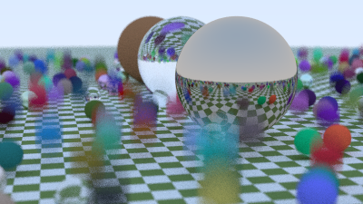
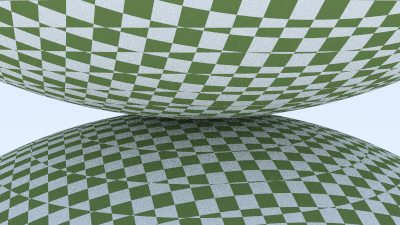

# Rust Language Ray Tracing Tutorial
Tutorial link:
[RayTracing v3.2.3](https://github.com/RayTracing/raytracing.github.io/releases/tag/v3.2.3)

Phase 1 image
 

 
Phase 2 image
 

 
Phase 3 image
 

 
Phase 4 image
 

 
Phase 5 image
 

 
Phase 6 image (same as previous but with antialiasing)
 

 
Phase 7 image
 

 
Phase 8 image
 

 
Phase 9 image
 

 
Phase 10 image
 

 
Phase 11 image
 

 
Phase 12 image
 

 
Phase 13 image
 

 
Phase 14 image
 

 
Phase 15 image
 

 
Phase 16 image
 

 
Phase 17 image
 

 
Phase 18 image
 

 
Phase 19 image
 

 
Phase 20 image and final render of **Ray Tracing in One Weekend** tutorial
 

 
 
**Ray Tracing The Next Week**
 
 
Phase 21 image
 

 
Phase 22 image using BVH at this point (unsure if correctly)
 

 
Phase 23 image
 

